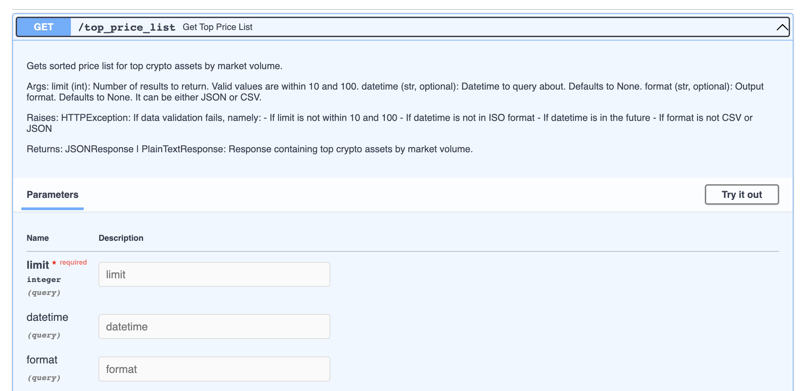

# Top crypto price list API service

## Description

This project implements an API service to query prices in USD for top crypto assets by market volume.

The source information is obtained from 2 external API services:
- [CryptoCompare](https://min-api.cryptocompare.com/), to get the top assets
- [CoinMarketCap](https://coinmarketcap.com/api/), to get USD prices for each crypto asset

The endpoint is available via a GET request at `/top_price_list`.

The user can perform a query in 2 modes:
- **current query**: the `datetime` parameter is omitted and the server returns the current top price list
- **historical query**: the `datetime` parameter is specified and the server returns the top price list at the specified time, if it is known

A mongo database is used to store information retrieved from the API services. This information is retrieved when:
- the user performs a historical query
- the user performs a current query and the server performed another current query within the last minute

The output can be provided as JSON or CSV. Mind that the `content-type` of each response is either `application/json` or `text/plain` accordingly, so clients should consider this when handling the response.

## Considerations on historical data

When retrieving historical data, an approximation is done to find the closest record to the requested `datetime` within a tolerance of one day.

Suppose that the database contains records for the following timestamps:
- `2023-08-15T08:40:13.932318+00:00`
- `2023-08-15T08:41:26.867010+00:00`
- `2023-08-15T13:49:31.095797+00:00`
- `2023-08-15T14:35:36.576541+00:00`
- `2023-08-15T14:38:05.959648+00:00`

Let's consider the following examples:
- If the user performs a query for `2023-08-14T08:00:00+00:00`, then no information is found within 24 hours of the existing records, so a `404 - not found` error will be returned.
- If the user performs a query for `2023-08-15T07:00:00+00:00`, then the closest timestamp found is `2023-08-15T08:40:13.932318+00:00`, so results for that snapshot will be returned.
- If the user performs a query for `2023-08-15T012:00:00+00:00`, then the closest timestamp found is `2023-08-15T13:49:31.095797+00:00`, so results for that snapthos will be returned.

This means the client should check the timestamp for the records returned in the response and should make no assumptions of those records being exact for the requested `timedate`.

Mind that all times are in ISO format and in the UTC timezone (i.e. 17:00 in CET is 15:00 in UTC).

## Error cases

There are a number of conditions that trigger errors, namely:
- if the user specifies a `limit` below 10 or above 100
- if the user specifies a `datetime` in the wrong format (only ISO format is supported, e.g. `2023-08-15 12:00:00+00:00`)
- if the user specifies a `datetime` in the future
- if the user specifies a `datetime` for which there are no records in the database (as specified above)

## Considerations about merging of coin data

The 2 sources of information for crypto coins are CryptoCompare and CoinMarketCap. The first one provides the ranking of top assets and the second one provides the USD prices.

In order to provide the expected matching of coins to prices, the service tries to perform a match by coin name over both services.

For instance, if `BTC` is returned by CryptoCompare, then the service tries to find  `BTC` in CoinMarketCap data. This works fine most of the time, but some coins are not named consistently across both services. For example:
- `AGI` in CryptoCompare is named `SingularityNet` in CoinMarketCap
- `ONGAS` in CryptoCompare is named `Ontology Gas` in CoinMarketCap

In order to increase the chances of matching all possible coins, the service tries to perform a match by symbol, then by name, e.g. first by `BTC`, and if that didn't match, then by `Bitcoin`. This means that:
- it is not guaranteed that all coins can be matched; if a coin cannot be matched it will be ignored for the purpose of generating the output, and
- there might potentially be false matches if some coin names collide in some representation.

## Considerations about performance

Whenever a current query is done, the service queries the external API services, CryptoCompare and CoinMaketCap (unless there was a recent current query and then it would return the cached result). In order to reduce latency, the 2 API requests are performed in parallel via python's `asyncio`.

Whenever a historical query is done, the service always queries the database for historical data. There is no effort to pre-fetch historical coin data at this point, so all available data for historical queries is the result from previous user queries.

The database is hosted in the mongo cloud and shared across instances of this service. If you deploy the solution (see next section), the DB will be pre-populated with the results of previous queries. Note that potentially, the database access could be slower than the external API access, depending on networking conditions.

## Deploying the solution locally

You can deploy the solution locally in 2 ways:
- clone the repo, install the dependencies (a virtual environment is recommended), and run the service with `uvicorn app.main:app`
- clone the repo, and spin up the service with `docker compose up`

For convenience, there is a Docker image available at the [Docker Hub](https://hub.docker.com/repository/docker/atineose/top_crypto_price_list/general).

In either case, you will need the deploy the secrets to the root folder, managed in a `.env` file, which will be provided separately.